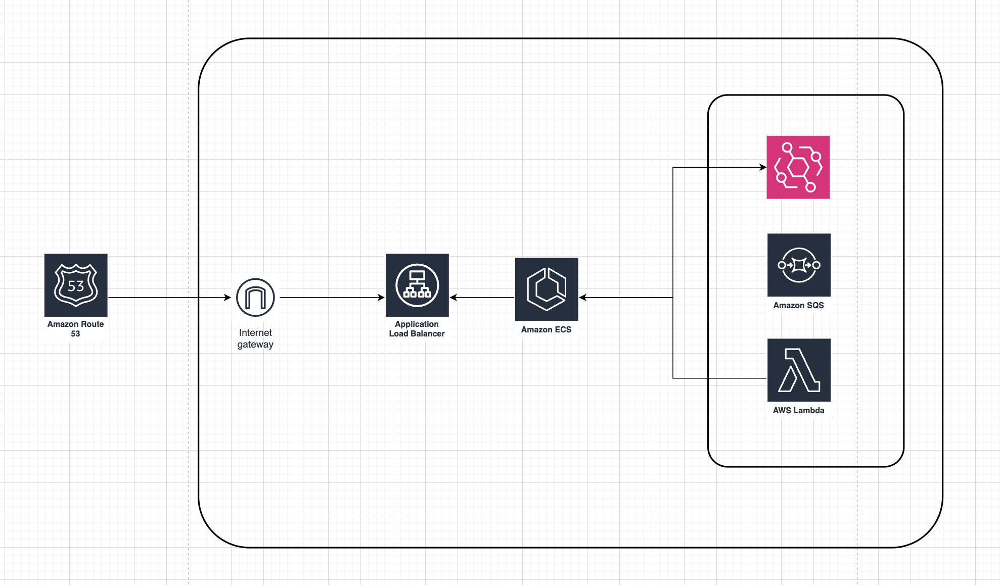
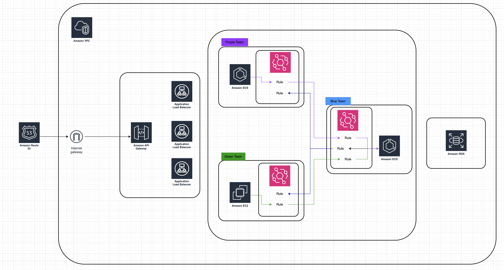
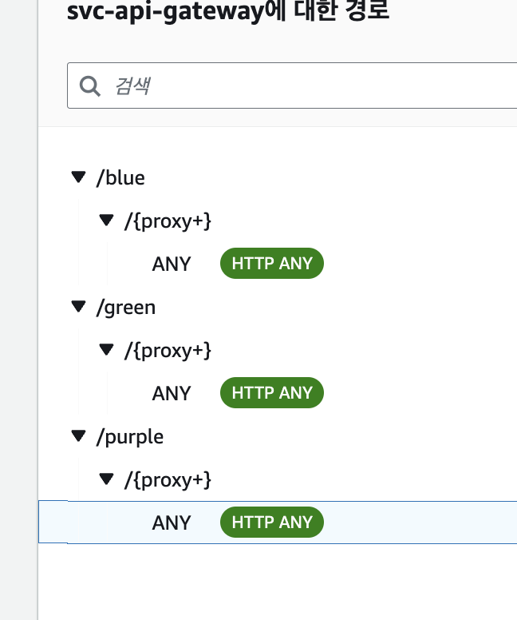

# EventBridge Architecture

## ECS Internal Service

## ECS Service use Event Bridge

## Progress... (테스트때문에 service destory만 진행함)

- [x] vpc, sqs
- [x] ecs (blue, green, purple)
    - [x] terraform cd
- [ ] api-gateway
- [ ] event bridge use SQS
    - [ ] purple -> blue
    - [ ] green -> blue
    - [ ] blue -> purple
    - [ ] blue -> green

## Desc

- Service
    - Blue
    - Purple
    - Green

- 내부 Internal 통신이 아닌, EventBridge 기반 통신
- EventBridge Role Based 기반으로 Service 팀내에서 관리 가능하도록 구성
- Rule 한개당 대상은 1개로 유지 (Best Practice)
- DLQ 큐는 Service Context 당 1개로 유지

## 1. API Gateway (이건 테라폼으로 안함...)

- /blue/{proxy+}
    - http://[BLUE_ALB_DNS]/{proxy}
- /green/{proxy+}
    - http://[GREEN_ALB_DNS]/{proxy}
- /purple/{proxy+}
    - http://[PURPLE_ALB_DNS]/{proxy}